# Sales Intelligence Platform

Governed sales analytics from heterogeneous Google Sheets data to a secure executive dashboard.


[](RELEASE_NOTES.md)
[](IMPLEMENTATION_ROADMAP.md)
[](tests/run-tests.js)
[](#technology-stack)

[Live Dashboard](https://sales-dashboard-beta-jade.vercel.app) | [Architecture](CORE_PLATFORM_ARCHITECTURE.md) | [KPI Dictionary](KPI_DICTIONARY.md) | [Operations Guide](docs/PHASE3_OPERATIONS.md) | [Release Notes](RELEASE_NOTES.md)

## Overview

The Sales Intelligence Platform turns operational sales, target, lifting, and related source sheets into a governed analytical model. Its Apps Script backend detects changing source headers, normalizes records, validates data quality, resolves business relationships, publishes a checksummed master dataset, and calculates deterministic KPIs. A standalone Next.js application consumes the certified KPI contract through a private Google Apps Script Execution API integration.

The project is built for business teams that need spreadsheet accessibility without allowing report logic, changing row positions, or ad hoc formulas to become the system of record.

## Product Capabilities

- Dynamic header detection for changing report-shaped source sheets
- Canonical long-form master dataset with lineage and batch identity
- Normalization, validation, quarantine, relationship resolution, and diagnostics
- Chunked, checksummed caching for Apps Script runtime limits
- One-pass KPI aggregation across executive and hierarchy levels
- Sales, target, collection, projection, lifting, inventory, dealer, and product views
- Working-day forecasts, confidence inputs, risks, and deterministic insights
- Identical KPI contracts at company, RSM, TSO, SR, dealer, and product levels
- Secure server-only OAuth bridge from Next.js to the Apps Script Execution API
- Responsive executive dashboard with live refresh and no direct browser credential exposure

Business definitions and certification boundaries are documented in [BUSINESS_INTELLIGENCE_SPECIFICATION.md](BUSINESS_INTELLIGENCE_SPECIFICATION.md), [KPI_DICTIONARY.md](KPI_DICTIONARY.md), and [DATABASE_DICTIONARY.md](DATABASE_DICTIONARY.md).

## Screenshots


The [full dashboard capture](assets/screenshots/sales-dashboard-desktop.png) shows hierarchy, commercial flow, risk, data quality, forecast, dealer, product, and operational report sections. Values visible in the public deployment are generated from the configured backend contract and should not be treated as audited financial statements.

## Architecture

```mermaid
flowchart LR
    Sources[Operational Google Sheets] --> Parsers[Apps Script parsers]
    Parsers --> Quality[Normalization and quality gates]
    Quality --> Master[(Canonical Master Dataset)]
    Master --> Cache[Checksummed chunk cache]
    Cache --> KPI[One-pass KPI engine]
    KPI --> Contract[Versioned consumer API]
    Contract --> Execution[Apps Script Execution API]
    Execution --> Server[Next.js server route]
    Server --> Dashboard[Executive dashboard]
```



The architectural invariant is simple: parsers are the only ingestion writers, the Master Dataset is the canonical analytical ledger, and every metric or dashboard is a read-only consumer. No KPI module reads raw source sheets or recalculates another module's formula.

Read [CORE_PLATFORM_ARCHITECTURE.md](CORE_PLATFORM_ARCHITECTURE.md) and the architecture decision records in [`docs`](docs) for the full contract.

## Technology Stack

| Layer | Technology |
| --- | --- |
| Source and stewardship | Google Sheets |
| Data engine and API | Google Apps Script, JavaScript |
| Analytical model | Canonical event/observation ledger, versioned KPI contracts |
| Frontend | Next.js 16, React 19, TypeScript, Tailwind CSS, Recharts |
| Authentication | Google OAuth refresh flow, server-only credentials |
| Delivery | Apps Script deployments, Vercel |
| Verification | Node.js regression suite, ESLint, TypeScript, Next.js build |

## Repository Structure

```text
src/                  Apps Script ingestion, quality, cache, KPI, risk, and API modules
tests/                Backend regression and performance tests
frontend/             Next.js dashboard and private backend adapter
docs/                 Architecture decisions, operations, security, and phase verification
appsscript.json        Apps Script runtime and OAuth scope manifest
*.md                   Business dictionaries, specifications, audits, and roadmap
```

## Local Verification

### Backend

```powershell
git clone https://github.com/itsmebillah/Sales-Dashboard.git
Set-Location Sales-Dashboard
npm test
```

The suite covers parsing, normalization, relationship resolution, validation, cache integrity, KPI contracts, risk rules, generation consistency, and a 100,000-observation performance budget.

### Frontend

```powershell
Set-Location frontend
npm ci
Copy-Item .env.example .env.local
npm run check
npm run dev
```

Open `http://localhost:3000`. A configured Apps Script executable deployment and Google OAuth credentials are required for live KPI data.

## Configuration

The frontend expects these server-only variables:

| Variable | Purpose |
| --- | --- |
| `APPS_SCRIPT_DEPLOYMENT_ID` | Apps Script API executable deployment identifier |
| `GOOGLE_OAUTH_CLIENT_ID` | OAuth client used by the server route |
| `GOOGLE_OAUTH_CLIENT_SECRET` | OAuth client secret |
| `GOOGLE_OAUTH_REFRESH_TOKEN` | Refresh token for the authorized Apps Script principal |

Never prefix these variables with `NEXT_PUBLIC_` or commit populated environment files. The browser calls only the same-origin `/api/kpi` route.

## Deployment

The backend is sheet-bound and exposed as an Apps Script API executable. The frontend is deployed independently to Vercel and calls that executable with server-side OAuth. Follow [docs/PHASE5_SECURITY_AND_DEPLOYMENT.md](docs/PHASE5_SECURITY_AND_DEPLOYMENT.md) and [docs/GOOGLE_OAUTH_SCOPE_REQUIREMENTS.md](docs/GOOGLE_OAUTH_SCOPE_REQUIREMENTS.md).

## Known Limitations

- Business definitions remain provisional until owner sign-off.
- Growth is unavailable for periods that are not comparable.
- Product mix remains source-unit-only until governed unit conversion exists.
- Receivable recovery, outstanding, aging, and DSO are not calculated without certified source facts.
- A clean frontend install currently reports transitive dependency advisories that require controlled dependency review.
- Local production builds require valid server-side Google credentials to exercise live data paths.

## Roadmap

Planned work and sequencing are maintained in [IMPLEMENTATION_ROADMAP.md](IMPLEMENTATION_ROADMAP.md). Changes to frozen core contracts require an architecture decision, migration/backfill plan, version increment, consumer-impact review, and audit entry.

## Contributing

Contributions must preserve the canonical dataset and KPI ownership rules. Start with the architecture records, run both backend and frontend checks, and document any business-definition change explicitly.

## License

No open-source license is currently declared. The source is publicly visible, but reuse rights are not granted until a license is added by the repository owner.

---

**Md. Masum Billah** | Data Analyst, Automation Developer, and Business Intelligence Specialist

[Portfolio](https://itsmebillah.github.io/) | [GitHub](https://github.com/itsmebillah) | [Email](mailto:itsmbillah@gmail.com) | [Live Demo](https://sales-dashboard-beta-jade.vercel.app) | [Documentation](CORE_PLATFORM_ARCHITECTURE.md) | [Related: Company Hub](https://github.com/itsmebillah/company-hub)
