# Sales Dashboard

Production sales analytics from governed Google Sheets data to an Apps Script executive dashboard.


[](RELEASE_NOTES.md)
[](docs/ADR-008-CACHE-ONLY-HTML-SERVICE-RUNTIME.md)
[](tests/run-tests.js)
[](#technology-stack)

[Live Dashboard](https://script.google.com/macros/s/AKfycbyy8kfJEm2wW0RCIEWO79n5sywY_4R0VbneQLRJBXaW1AHr12XJQeqdsT8oIC2q2jiJ/exec) | [Architecture](CORE_PLATFORM_ARCHITECTURE.md) | [KPI Dictionary](KPI_DICTIONARY.md) | [Operations Guide](docs/PHASE3_OPERATIONS.md) | [Documentation Index](docs/README.md) | [Release Notes](RELEASE_NOTES.md)

## Project

The Sales Intelligence Platform turns operational sales, target, lifting, and related source sheets into a governed analytical model. Its Apps Script backend detects changing source headers, normalizes records, validates data quality, resolves business relationships, publishes a checksummed master dataset, and calculates deterministic KPIs. The production dashboard is an Apps Script HTML Service Web App that reads only the certified KPI cache during initial loading.

The project is built for business teams that need spreadsheet accessibility without allowing report logic, changing row positions, or ad hoc formulas to become the system of record.

## Production

The [Apps Script HTML Service Web App](https://script.google.com/macros/s/AKfycbyy8kfJEm2wW0RCIEWO79n5sywY_4R0VbneQLRJBXaW1AHr12XJQeqdsT8oIC2q2jiJ/exec) is the only supported production dashboard. It runs from the sheet-bound Apps Script project `1H88OzmYKwSNSOx8X4K_seVPZkP8xB7EOMUciAdClS5qLEF1s04gyr7oi` and reads the certified KPI cache. Vercel, Next.js, and standalone Apps Script hosts are retired and are not deployment targets.

## Product Capabilities

- Dynamic header detection for changing report-shaped source sheets
- Canonical long-form master dataset with lineage and batch identity
- Normalization, validation, quarantine, relationship resolution, and diagnostics
- Chunked, checksummed caching for Apps Script runtime limits
- One-pass KPI aggregation across executive and hierarchy levels
- `Hierarchy tab` as the canonical ASM/RSM/TSO/SR/Dealer provider; the legacy generated hierarchy is retained only for rollback
- HR Attendance joined by stable SR ID and explicit date, with the Attendance month linked to the selected Sales month
- Strict selected-period alignment for operational Sales, Target, Lifting, Collection, and Projection facts
- Sales, target, collection, projection, lifting, inventory, dealer, and product views
- Working-day forecasts, confidence inputs, risks, and deterministic insights
- Identical KPI contracts at company, ASM, RSM, TSO, SR, Territory, Area, dealer, and product levels; missing Area/Region sources remain empty rather than being aliased
- Cache-only dashboard hydration that cannot trigger source parsing
- Responsive Apps Script HTML Service dashboard with controlled live refresh

Business definitions and certification boundaries are documented in [BUSINESS_INTELLIGENCE_SPECIFICATION.md](BUSINESS_INTELLIGENCE_SPECIFICATION.md), [KPI_DICTIONARY.md](KPI_DICTIONARY.md), and [DATABASE_DICTIONARY.md](DATABASE_DICTIONARY.md).

## Screenshots


The [full dashboard capture](assets/screenshots/sales-dashboard-desktop.png) shows hierarchy, commercial flow, risk, data quality, forecast, dealer, product, and operational report sections. Values visible in the public deployment are generated from the configured backend contract and should not be treated as audited financial statements.

## Architecture

```mermaid
flowchart LR
    Sources[Sales, Lifting, Projection, Hierarchy tab, Attendance] --> Parsers[Apps Script parsers]
    Parsers --> Quality[Normalization and quality gates]
    Quality --> Master[(Canonical Master Dataset)]
    Master --> MasterCache[Checksummed Master cache]
    MasterCache --> KPI[One-pass KPI engine]
    KPI --> KpiCache[Certified KPI cache]
    KpiCache --> HTML[Apps Script HTML Service]
    HTML --> Dashboard[Executive dashboard]
```



The architectural invariant is simple: parsers are the only ingestion readers, the Master Dataset is the canonical analytical ledger, and every metric or dashboard is a read-only consumer. Hierarchy and Attendance remain compact runtime/cache models instead of being duplicated into large generated fact sheets. No KPI module reads raw source sheets or recalculates another module's formula.

Read [CORE_PLATFORM_ARCHITECTURE.md](CORE_PLATFORM_ARCHITECTURE.md) and the architecture decision records in [`docs`](docs) for the full contract.

## Data Sources

The production spreadsheet is `1HxVEJqWqIc_xSGIBYJpJBIuHeqTaQiUUJ_Lc7jLKlSY`. The ingestion layer reads these business tabs by name:

| Tab | Role |
| --- | --- |
| `Sales Data Base Monthly` | Current selected-month Sales and Target facts; `AZ3` is the authoritative working-day total for that reporting month |
| `Previous Month Sales` | Optional comparable prior-period Sales |
| `Dealer lifting` | Dealer lifting facts |
| `Monthly Projection` | Collection and Projection facts |
| `Hierarchy tab` | Canonical ASM/RSM/TSO/Territory/SR/Dealer hierarchy; Area remains independent and empty without a real source |
| `Attendance` | HR attendance joined by SR ID and explicit attendance date |
| `Configuration` and `Holiday` | Business-calendar policy and approved holidays |

The generated `Master Dataset`, `Relationship Model`, and legacy `Hierarchy` sheets are not source-of-truth inputs. The legacy hierarchy is retained only as a rollback archive.

## Technology Stack

| Layer | Technology |
| --- | --- |
| Source and stewardship | Google Sheets |
| Data engine and API | Google Apps Script, JavaScript |
| Analytical model | Canonical event/observation ledger, versioned KPI contracts |
| Frontend | Apps Script HTML Service, modular HTML/CSS/JavaScript, Canvas |
| Security | Private Sheet, public aggregate Web App, no browser credentials |
| Delivery | Versioned Apps Script Web App deployment |
| Verification | Node.js regression and performance suite |

## Repository Structure

```text
src/                  Apps Script ingestion, quality, cache, KPI, risk, and API modules
tests/                Backend regression and performance tests
docs/                 Architecture decisions, operations, and phase verification
appsscript.json        Apps Script runtime and OAuth scope manifest
*.md                   Business dictionaries, specifications, audits, and roadmap
```

## Development

The delivery path is `local Git -> GitHub main -> clasp -> bound Apps Script project -> versioned Web App deployment`. Feature branches may be used for review, but production releases must be contained in `main` before clasp deployment.

```powershell
git clone https://github.com/itsmebillah/Sales-Dashboard.git
Set-Location Sales-Dashboard
npm ci
npm test
```

The suite covers parsing, normalization, hierarchy migration, Attendance month/date joins, target parsing, period alignment, relationship resolution, validation, cache integrity, KPI contracts, risk rules, generation consistency, and a 100,000-observation performance budget.

The optional live audit uses the locally installed Chrome or Edge executable and does not download a browser:

```powershell
$env:PRODUCTION_WEB_APP_URL='https://script.google.com/macros/s/AKfycbyy8kfJEm2wW0RCIEWO79n5sywY_4R0VbneQLRJBXaW1AHr12XJQeqdsT8oIC2q2jiJ/exec'
$env:BROWSER_EXECUTABLE='C:\Program Files\Google\Chrome\Application\chrome.exe'
$env:RUN_INTERACTIONS='true'
$env:FILTER_AUDIT='true'
npm run audit:production
```

## Deployment

The production Apps Script project is bound to the private source spreadsheet and deployed as a public HTML Service Web App that executes as the deployer. The browser never receives the spreadsheet or raw records. Initial load calls only the certified KPI cache; explicit refresh runs the Data Engine once, recalculates KPIs from that Master Dataset, and republishes the cache. See [ADR-008](docs/ADR-008-CACHE-ONLY-HTML-SERVICE-RUNTIME.md).

Deploy only a reviewed, clean `main` checkout:

```powershell
git switch main
git pull --ff-only
npm test
npx --yes @google/clasp@latest push
npx --yes @google/clasp@latest version "release summary"
npx --yes @google/clasp@latest deploy --deploymentId AKfycbyy8kfJEm2wW0RCIEWO79n5sywY_4R0VbneQLRJBXaW1AHr12XJQeqdsT8oIC2q2jiJ --versionNumber <VERSION> --description "release summary"
npx --yes @google/clasp@latest deployments
```

The deployer must be signed into clasp with edit access to the bound Apps Script project. Deployment and refresh operations require the manifest's spreadsheet and script scopes. Never commit clasp credentials, OAuth tokens, Sheet exports, or production data.

## Known Limitations

- Business definitions remain provisional until owner sign-off.
- Growth is unavailable for periods that are not comparable.
- Product mix remains source-unit-only until governed unit conversion exists.
- Receivable recovery, outstanding, aging, and DSO are not calculated without certified source facts.

## Roadmap

Planned work and sequencing are maintained in [IMPLEMENTATION_ROADMAP.md](IMPLEMENTATION_ROADMAP.md). Changes to frozen core contracts require an architecture decision, migration/backfill plan, version increment, consumer-impact review, and audit entry.

## Contributing

Contributions must preserve the canonical dataset and KPI ownership rules. Start with the architecture records, run the production test suite, and document any business-definition change explicitly.

## License

No open-source license is currently declared. The source is publicly visible, but reuse rights are not granted until a license is added by the repository owner.

---

**Md. Masum Billah** | Data Analyst, Automation Developer, and Business Intelligence Specialist

[Portfolio](https://itsmebillah.github.io/) | [GitHub](https://github.com/itsmebillah) | [Production owner](mailto:ptcoffice20@gmail.com) | [Live Demo](https://script.google.com/macros/s/AKfycbyy8kfJEm2wW0RCIEWO79n5sywY_4R0VbneQLRJBXaW1AHr12XJQeqdsT8oIC2q2jiJ/exec) | [Documentation](CORE_PLATFORM_ARCHITECTURE.md)
