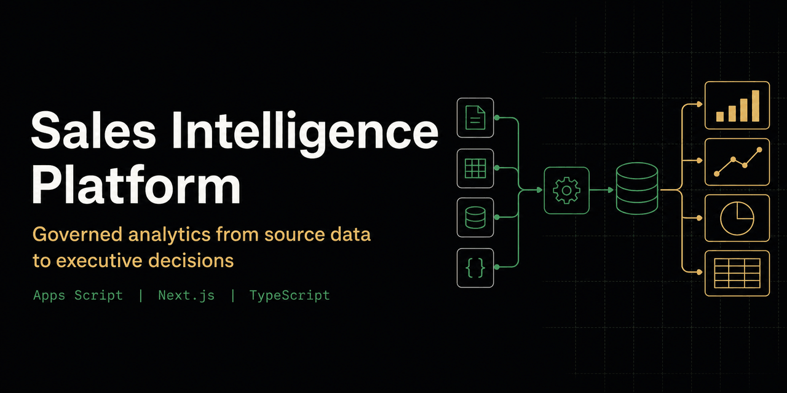
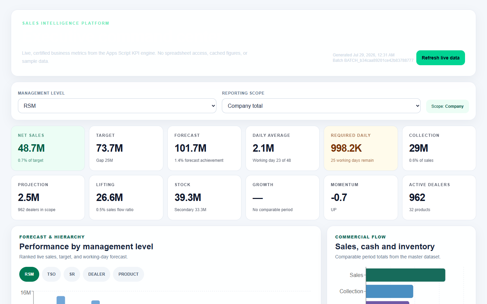

# Sales Intelligence Platform

Governed sales analytics from heterogeneous Google Sheets data to a secure executive dashboard.



[](RELEASE_NOTES.md)
[](IMPLEMENTATION_ROADMAP.md)
[](tests/run-tests.js)
[](#technology-stack)

[Live Dashboard](https://script.google.com/macros/s/AKfycbyy8kfJEm2wW0RCIEWO79n5sywY_4R0VbneQLRJBXaW1AHr12XJQeqdsT8oIC2q2jiJ/exec) | [Architecture](CORE_PLATFORM_ARCHITECTURE.md) | [KPI Dictionary](KPI_DICTIONARY.md) | [Operations Guide](docs/PHASE3_OPERATIONS.md) | [Release Notes](RELEASE_NOTES.md)

## Overview

The Sales Intelligence Platform turns operational sales, target, lifting, and related source sheets into a governed analytical model. Its Apps Script backend detects changing source headers, normalizes records, validates data quality, resolves business relationships, publishes a checksummed master dataset, and calculates deterministic KPIs. The production dashboard is an Apps Script HTML Service Web App that reads only the certified KPI cache during initial loading.

The project is built for business teams that need spreadsheet accessibility without allowing report logic, changing row positions, or ad hoc formulas to become the system of record.

## Product Capabilities

- Dynamic header detection for changing report-shaped source sheets
- Canonical long-form master dataset with lineage and batch identity
- Normalization, validation, quarantine, relationship resolution, and diagnostics
- Chunked, checksummed caching for Apps Script runtime limits
- One-pass KPI aggregation across executive and hierarchy levels
- Sales, target, collection, projection, lifting, inventory, dealer, and product views
- Working-day forecasts, confidence inputs, risks, and deterministic insights
- Identical KPI contracts at company, RSM, TSO, SR, dealer, and product levels
- Cache-only dashboard hydration that cannot trigger source parsing
- Responsive Apps Script HTML Service dashboard with controlled live refresh

Business definitions and certification boundaries are documented in [BUSINESS_INTELLIGENCE_SPECIFICATION.md](BUSINESS_INTELLIGENCE_SPECIFICATION.md), [KPI_DICTIONARY.md](KPI_DICTIONARY.md), and [DATABASE_DICTIONARY.md](DATABASE_DICTIONARY.md).

## Screenshots



The [full dashboard capture](assets/screenshots/sales-dashboard-desktop.png) shows hierarchy, commercial flow, risk, data quality, forecast, dealer, product, and operational report sections. Values visible in the public deployment are generated from the configured backend contract and should not be treated as audited financial statements.

## Architecture

```mermaid
flowchart LR
    Sources[Operational Google Sheets] --> Parsers[Apps Script parsers]
    Parsers --> Quality[Normalization and quality gates]
    Quality --> Master[(Canonical Master Dataset)]
    Master --> MasterCache[Checksummed Master cache]
    MasterCache --> KPI[One-pass KPI engine]
    KPI --> KpiCache[Certified KPI cache]
    KpiCache --> HTML[Apps Script HTML Service]
    HTML --> Dashboard[Executive dashboard]
```



The architectural invariant is simple: parsers are the only ingestion writers, the Master Dataset is the canonical analytical ledger, and every metric or dashboard is a read-only consumer. No KPI module reads raw source sheets or recalculates another module's formula.

Read [CORE_PLATFORM_ARCHITECTURE.md](CORE_PLATFORM_ARCHITECTURE.md) and the architecture decision records in [`docs`](docs) for the full contract.

## Technology Stack

| Layer | Technology |
| --- | --- |
| Source and stewardship | Google Sheets |
| Data engine and API | Google Apps Script, JavaScript |
| Analytical model | Canonical event/observation ledger, versioned KPI contracts |
| Frontend | Apps Script HTML Service, modular HTML/CSS/JavaScript, Canvas |
| Security | Private Sheet, public aggregate Web App, no browser credentials |
| Delivery | Versioned Apps Script Web App deployment |
| Verification | Node.js regression and performance suite |

## Repository Structure

```text
src/                  Apps Script ingestion, quality, cache, KPI, risk, and API modules
tests/                Backend regression and performance tests
frontend/             Legacy Next.js consumer retained for compatibility
docs/                 Architecture decisions, operations, security, and phase verification
appsscript.json        Apps Script runtime and OAuth scope manifest
*.md                   Business dictionaries, specifications, audits, and roadmap
```

## Local Verification

### Backend

```powershell
git clone https://github.com/itsmebillah/Sales-Dashboard.git
Set-Location Sales-Dashboard
npm test
```

The suite covers parsing, normalization, relationship resolution, validation, cache integrity, KPI contracts, risk rules, generation consistency, and a 100,000-observation performance budget.

## Deployment

The production Apps Script project is bound to the private source spreadsheet and deployed as a public HTML Service Web App that executes as the deployer. The browser never receives the spreadsheet or raw records. Initial load calls only the certified KPI cache; explicit refresh runs the Data Engine once, recalculates KPIs from that Master Dataset, and republishes the cache. See [ADR-008](docs/ADR-008-CACHE-ONLY-HTML-SERVICE-RUNTIME.md).

## Known Limitations

- Business definitions remain provisional until owner sign-off.
- Growth is unavailable for periods that are not comparable.
- Product mix remains source-unit-only until governed unit conversion exists.
- Receivable recovery, outstanding, aging, and DSO are not calculated without certified source facts.
- The retired Next.js compatibility client has no production dependency
  vulnerabilities. Its development-only ESLint graph contains an upstream
  advisory whose forced ESLint 10 upgrade is incompatible with Next.js 16's
  current React lint plugins.

## Roadmap

Planned work and sequencing are maintained in [IMPLEMENTATION_ROADMAP.md](IMPLEMENTATION_ROADMAP.md). Changes to frozen core contracts require an architecture decision, migration/backfill plan, version increment, consumer-impact review, and audit entry.

## Contributing

Contributions must preserve the canonical dataset and KPI ownership rules. Start with the architecture records, run both backend and frontend checks, and document any business-definition change explicitly.

## License

No open-source license is currently declared. The source is publicly visible, but reuse rights are not granted until a license is added by the repository owner.

---

**Md. Masum Billah** | Data Analyst, Automation Developer, and Business Intelligence Specialist

[Portfolio](https://itsmebillah.github.io/) | [GitHub](https://github.com/itsmebillah) | [Production owner](mailto:ptcoffice20@gmail.com) | [Live Demo](https://script.google.com/macros/s/AKfycbyy8kfJEm2wW0RCIEWO79n5sywY_4R0VbneQLRJBXaW1AHr12XJQeqdsT8oIC2q2jiJ/exec) | [Documentation](CORE_PLATFORM_ARCHITECTURE.md)
